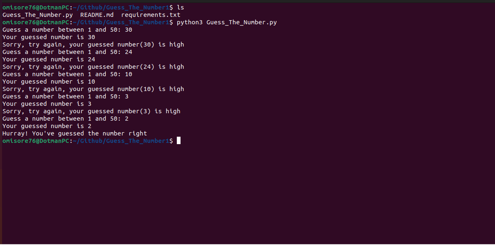

# Guess_The_Number1

##Introduction

Guessing games are always fun, whether you're playing with a friend or trying to beat a computer. In this particular game, the computer has a secret number and it's up to you to try and guess what that number is. You can make as many guesses as you want, but the closer you are to the computer's number, the better. If you can guess the number exactly, then you win! But even if you don't quite manage to get the right answer, it's still a fun game to play. So why not give it a try? You might be surprised at how close you can get.



## Prerequisite
- Python3 installed on your local address

## How to Use This Repo

- Fork the repo

- Clone it on your local machine

- While in the project repo on your local machine, create a virtual environment. Run the code below to create a virtual environment
```
	python3 -m venv venv_001
```
- Activate the virtual environment
```
	source venv_001/bin/activate
```
- Install requirements
```
	pip install -r requirements.txt
```
- Run the app
```
	python3 Guess_The_Number.py
```
- Enter the number of password(s) needed, as well as the desired length of your password

- Finally, deactivate the virtual environment once done 
```
deactivate
```
## Tips

Feel free to edit the code to suit your needs!

